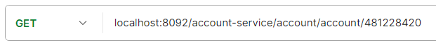
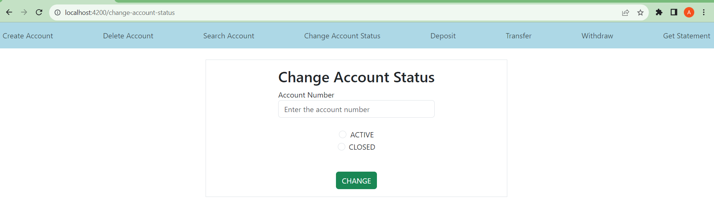

# Full-Stack Application with Java, Spring Boot, TypeScript, and Angular
This application is live at https://banking-angular-920510b7cbf3.herokuapp.com

This is a microservices-based application following the microservices architecture. It consists of four microservices: Service Registry, API Gateway, Transaction, and Account. The application provides various API endpoints for managing accounts and transactions.

The application facilitates the following actions:
   - Creating new bank accounts
   - Deleting accounts
   - Changing the account status to CLOSED or ACTIVE
   - Searching for account details
   - Depositing funds into the account
   - Transferring funds between accounts
   - Withdrawing funds from the account
   - Getting the account statement, including transaction details

## Microservices
### Service Registry
The Eureka Service Registry microservice is responsible for registering and discovering other microservices in the system. It uses Netflix Eureka Server to manage service registration and discovery.

### API Gateway
   The API Gateway microservice acts as an entry point for client requests and routes them to the appropriate microservice.

### Transaction
   The Transaction microservice manages financial transactions, including deposit, withdrawal, and transfers between accounts. It also provides access to account statements.

### Account
   The Account microservice handles account-related operations, such as creating, retrieving, updating account status, and deleting accounts.

## API Endpoints
### Account Service

- Create Account (POST):
   - Endpoint: `localhost:8092/account-service/account/add`
   - Description: Create a new account.
  
  

- Get Account Details (GET):
   - Endpoint: `localhost:8092/account-service/account/account/{accountNumber}`
   - Description: Retrieve account details by account number.
  

- Change Account Status (PUT):
   - Endpoint: `localhost:8092/account-service/account/{accountNumber}/{accountStatus}`
   - Description: Change the account status to CLOSED or ACTIVE.
  

- Delete Account (DELETE):
   - Endpoint: `localhost:8092/account-service/account/{accountNumber}`
   - Description: Delete an account.
  

### Transaction Service

- Deposit (PUT):
   - Endpoint: `localhost:8092/transaction-service/transaction/deposit`
   - Description: Make a deposit transaction.
  
  

- Withdraw (PUT):
   - Endpoint: `localhost:8092/transaction-service/transaction/withdraw`
   - Description: Make a withdrawal transaction.
  
  

- Transfer (PUT):
   - Endpoint: `localhost:8092/transaction-service/transaction/transfer`
   - Description: Make a transfer transaction.
  
  

- Get Account Statement (GET):
   - Endpoint: `localhost:8092/transaction-service/transaction/statement/{accountNumber}`
   - Description: Get the account statement, including all transactions for a specific account.

  

## Angular Frontend Screenshots

## Getting Started

To get started with this application, follow these steps:

1. Clone this repository to your local machine.

2. Set up and run the microservices (Service Registry, API Gateway, Transaction, and Account) using the provided instructions in their respective README files.

3. Access the API endpoints mentioned above to interact with the application.

## Technologies Used

- Java
- Spring Boot
- TypeScript
- Angular
- WebClient
- RestAPI
